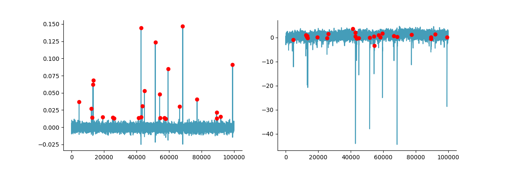

.. _mini_methods:

Mini methods
================
This section describes how mini or spontaneous postsynaptic events are found in the Mini
analysis module of ClampSuite to make the program less of a black box. For an explanation
on how to use the GUI see: :doc:`mini analysis </modules/mini_analysis>`.

Background
~~~~~~~~~~~~
Automatic identification mini or spontaneous postsynaptic events is a somewhat challenging
analysis. Many programs use template matching. This essentially slides a template mini along
a signal and finds areas where of that highly overlap the template. Template matching works
well except if events have a large variance in amplitude and decay tau. There is a better
method. The method was first published in the paper Pernia-Andrade et al., 2012 from Peter
Jonas' lab. The Pernia-Andrade method uses FFT deconvolution to find mini events.

Finding postsynaptic events with FFT deconvolution
~~~~~~~~~~~~~~~~~~~~~~~~~~~~~~~~~~~~~~~~~~~~~~~~~~~~~~~~~~~~~~~~
The FFT deconvolution method is pretty good method to find postsynaptic events. Deconvolution
is used to recover an original signal that has passed through some filter. Ideally you know
what the filter is and in the case of a postsynaptic event we know an equation to describe a 
postsynaptic event. To implement the FFT deconvolution to find postsynaptic events you need to
start with a signal such as the one below.

The signal still needs to be filtered. Filtering has a large effect on deconvolution so be sure 
to filter your signal. See the :doc:`filtering tutorial </analysis_methods/filtering>` for more
for more information on filtering a signal. Esssentially the more noise your signal has
the worse the FFT deconvolution works because FFT deconvolution is a noise method. Here is a well 
filtered version of the signal above:

Next step is to create a template mini using the code below and insert it into a kernel. 
While the exact shape of the template is not very important the spacer that offsets the template
from the start of the kernel is very important as this changes were the postsynaptic event will
be found. ClampSuite uses a kernel that identifies postsynatpic events right before they start. 
The kernel is an array, the same length as your signal of interested filled with zeros
everywhere except where the template will be placed. See below for an example template and kernel.

::

    A = (tau_2 / tau_1) ** (tau_1 / (tau_1 - tau_2))
    y = (amplitude / A * ((1 - (np.exp(-t_length / tau_1))) ** risepower * np.exp((-t_length / tau_2))))

Once your kernel is created you take the fast Fourier transform (FFT) of the signal and the kernel.
Then you divide the signal FFT by the kernel FFT take the inverse FFT of the resulting division.
The filtered deconvolved array will have peaks where the postsynaptic events are. The deconvolved
array needs to be filtered otherwise the peaks can be hidden in the noise.

The you can use use a peak finding function like the find_peaks provided on by Scipy to 
find all the events. One change I made from the original method in the paper (Pernia-Andrade et al)
is to take the root mean square (rms) of the middle 95% of the points. When you deconvolve signals
with large peaks, the resulting delta functions are also large which skews the standard deviation.
This makes is hard to 
The events still need to be checked and analyzed. Sometimes the
deconvolved peaks overlap leading to duplicated events, however this can be easily be
checked during analysis.

Here is the code to run the deconvolution and peak finding:

::

    import numpy as np
    from scipy import fft, signal

    from clampsuite.functions.template_psc import create_template
    from clampsuite.functions.filtering_functions import fir_zero_1

    acq_fft = fft.fft((acq.plot_acq_y()))
    template = create_template(amplitude=-20)

    kernel = np.zeros(len(acq.plot_acq_y()))
    kernel[: len(template)] = template
    kernel_fft = fft.fft(kernel)

    decon = np.real(fft.ifft(acq_fft / kernel_fft))
    decon_filtered = fir_zero_1(
        array=decon,
        sample_rate=acq.sample_rate,
        order=351,
        high_pass=None,
        high_width=None,
        low_pass=300,
        low_width=100,
        window="hann",
    )

    #%%
    bottom, top = np.percentile(decon_filtered, [2.5, 97.5])
    middle = np.hstack(
        decon_filtered[np.argwhere((decon_filtered > bottom) & (decon_filtered < top))]
    )
    # Calculate the mean and rms.
    mu = np.mean(middle)
    rms = np.sqrt(np.mean(np.square(middle - mu)))

    # Find the events.
    peaks, _ = signal.find_peaks(
        decon_filtered - mu,
        height=4.5 * (rms),
        distance=2 * (10000 / 1000),
        prominence=rms
    )