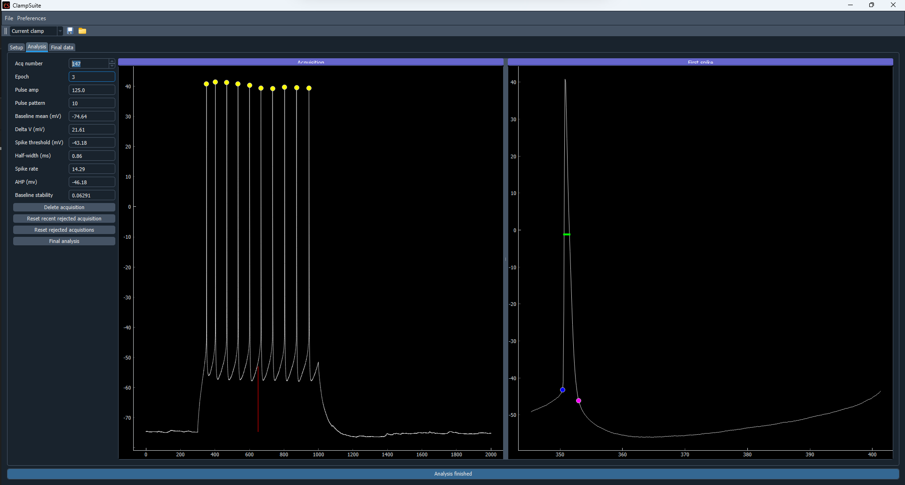

Current clamp
==================

The current clamp module is designed to analyze voltage pulses or voltage ramps while in
current clamp. Current clamp has three steps; Setup, Analysis, and Final data. The current
clamp module does not currently filter the acquisitions.

Setup
~~~~~~~~~~~
To begin analyzing data just drap and drop your files into into the acquistion part of
the GUI.

* **Baseline start (ms)**: Sets the starting point to measure the baseline.
* **Baseline end (ms)**: Sets the ending point of the baseline.
* **Sample rate (Hz)**: Set the sample rate of the data.
* **Pulse start (ms)**: Set the start of the voltage pulse.
* **Pulse end (ms)**: Set the end of the voltage. It can be useful to set the end time
  a couple ms past the real pulse ending.
* **Ramp start (ms)**: Set the start of the voltage ramp.
* **Ramp end (ms)**: Set the end of the voltage. It can be useful to set the end time
  a couple ms past the real ramp ending.
* **Min spike threshold (mV)**: The minimum voltage a spike needs to be to be counted.
* **Threshold method**: There are two methods to find the spike threshold. Max_curvature
  by dividing the first derivative by the the acquisition. The third derivative uses the
  third derivative.
* **Min spikes**: The minimum number of spikes an acquisition needs for the spikes to be
  analyzed.
* **IV curve start**: The index of the acquisition that you want to start measuring
  the IV curve for the final analysis. If you pulse go from -100 to 100 in 25 mV steps
  then the first pulse will be -100. If your epochs start at different pulse amplitudes
  then the first pulse be what ever the nth pulse amplitude in the epoch is.
* **IV curve end**: The index of the acquisition that you want to start measuring
  the IV curve for the final analysis. If you pulses go from -100 to 100 in 25 mV steps
  then the last pulse will be 25 mV. If your epochs start at different pulse amplitudes
  then the last pulse be what ever the nth pulse amplitude in the epoch is.

Analysis
~~~~~~~~~~~~~~
The Analysis contains the acquisition information on the left, the acquisition plot in the
middle and the first spike plot on the right.

* **Acquisition**: This spinbox is used to select the acquisition you want to view. Values
  can be changed using the arrow buttons or by inputing a number and hitting enter.
* **Epoch**: Shows the epoch of the aquisition. Epoch is using by ScanImage to define when
  what cell your are recording. For file types that include many acquisitions each file will be
  assigned an epoch. For file types that contain a single acquisition and do not specify epoch
  you can edit the epoch by typing in the epoch number and hitting enter.
* **Pulse amp**: Shows the pulse amplitude of the acquisition.  Epoch is using by ScanImage to define when
  what cell your are recording. For file types that include many acquisitions each file will be
  assigned an epoch. For file types that contain a single acquisition and do not specify epoch
  you can edit the epoch by typing in the epoch number and hitting enter.
* **Baseline mean (mV)**: The mean of the acquisition's baseline.
* **Delta V (mV)**: The difference in the voltage between the baseline and the pulse. The delta V is
  shown by the vertical red line on the acquisition plot.
* **Spike threshold (mV)**: The spike threshold of the first action potential if the acquisition
  contains more than at the least the minimum number of spikes specified. The spike threshold is
  specified as the blue dot on the first spike plot.
* **Half-width (ms)**: The half-width of the first spike. The half-width is shown by the green line
  on the first spike plot.
* **Spike rate**: The spike rate of the acquisition if the acquisition contains more than
  at the least the minimum number of spikes specified. Spike rate is analyzed as the length of
  the pulse in seconds divided by the number of spikes. The spikes that are counted are shown in
  yellow on the acquisition plot.
* **AHP (mV)**: The peak afterhyperpolorization of the first spike. The AHP is shown as the magenta
  dot on the first spike plot
* **Baseline stability**: The difference between the baseline before the pulse start and after the pulse
  end.

Final Data
~~~~~~~~~~~~~~
The Final data tab contains the raw and final data and plots for IV curves, FI curves and averaged first
action potentials.