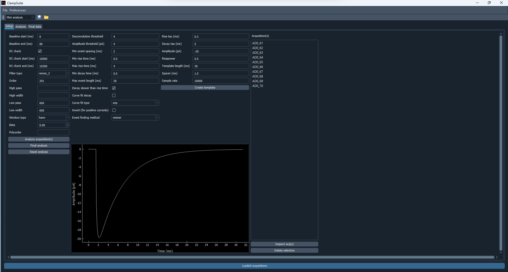
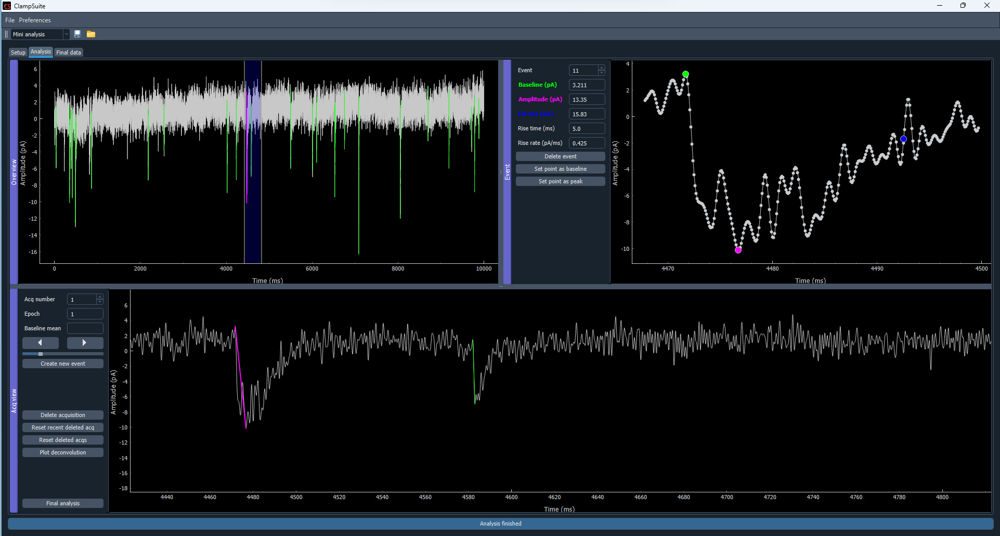
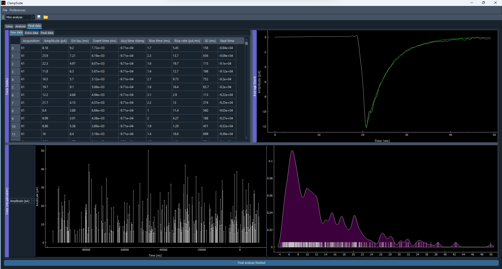

.. _mini_analysis:

Mini analysis
================

The mini analysis module is designed to analyzed spontaneous postsynaptic currents
(mEPSCs, sEPSCs, mIPSCs, sIPSCs). Both outward (positive) and inward currents can be
analyzed. Currently, outward currents inverted when analyzed. Mini analysis has
three steps; Setup, Analysis, and Final Data. For explanation of how Mini Analysis
module works under the hood see the :doc:`mini methods </analysis_methods/mini_methods>`
section.

Setup
~~~~~~~~~~
To begin analyzing data just drap and drop your files into into the GUI. For analyzing 
minis you will need to specify the filtering, the criteria for selecting minis and
creating a temp. The default settings should work for most cells that have a decay tau
around 5 ms.

Filtering
---------------
For an in-depth discussion of filtering see :doc:`filtering tutorial </analysis_methods/filtering>`.
Filtering can change the amplitude, rise rate/time and tau of the events so it is important
to keep the filtering settings the same for each experiment.

Mini criteria
-------------------
There are several criteria that need to be specified find and determine whether a mini event
is good or not. 

* **Deconvolution threshold**: This threshold is adapative and should adjust fairly well to
  acquisitions with a lot of events or large amplitude events. The threshold is used to
  initially identify events for further analysis.
* **Amplitude threshold**: This is the minimum amplitude of mini event you want to analyze.
* **Min mini spacing (ms)**: The minimum time between events
* **Min rise time (ms)**: The minimum rise time of an event. Setting this lower than 0.5 may
  result in more noise being considered an event.
* **Max rise time (ms)**: The maximum rise time of an event. This screen out events that are
  typically disrupted by noise so may be a low quality event.
* **Min decay time (ms)**: The minimum decay time of an event. Setting this higher than 0.5 ms
  can help reduce the amount of false positives if you cell has a slower tau.
* **Decay slower than rise**: Selecting this means your events should have a decay that is slower
  the rise time. Similar to max rise time (ms) this can reduce the number of poor quality events.
  We have found that for cells with a fast tau this needs to be turned off.
* **Curve fit tau**: Select this is you want to curve fit tau. Currently the curve fitting is
  fully impemented. Curve fitting individual minis is not very useful. The program automatically
  calculates the estimated tau which should give very similar results to the curve fit tau.
* **Deconvolution type**: Wiener and FFT deconvolution are very similar. Wiener deconvolution is
  supposed to have a better signal to noise ratio. FFT is the original deconvolution method.
* **Baseline correction**: This is very experimental so I don't suggest using it. This is supposed to
  correct for a baseline that is wavy or unstable but it does not work very well yet.

Template criteria
-----------------------
While mini analysis is a technically a template based mini finding algorithm, the template shape
is not very important. Mini analysis using a deconvolution based method rather than the tradional
template matching which is kind of the inverse of deconvolution. The stock template settings
should work pretty well for almost any type of mini analysis.

* **Rise tau (ms)**: The rise tau of the template. Rise tau is similar to decay tau.
* **Decay tau (ms)**: The decay tau of the template.
* **Risepower**: The is similar to the rise tau but has a much larger effect on the rise time
  than rise tau does. 
* **Template length**: the length of the template excluding the baseline.
* **Spacer (ms)**: The spacer is probably the most important part of the template design.
  The spacer setting changes where the deconvolution "finds" the mini. To current setting
  should work for analyzing most minis.

Analysis
~~~~~~~~~~~~~
The Analysis tab has three different windows. Each of the windows can be resized but not
moved around. You can hide a window by dragging it in on direction. Note that the two
top windows will both be hidden even if you drag just one window up.

Overview window (top left)
----------------------------------
The top left window is general overview window. The event are highlighted in green.
The green line for each event goes from the baseline to the peak of the event. The
purple event is the event displayed in the top right plot. There is
a blue bar that can be dragged back and forth. This will scroll the plot in the bottom
window. The x coordinates of each side of the blue bar correspond to the x-range in the
bottom plot.

Acquisition window (bottom window)
-----------------------------------------
The bottom window is the view that you can get a closer look at the events. If you click
on the green line that is over an event is will select that event and display it in the
top right window. If the line is magenta that means the event is being displayed in the
top right window. This window will can be scrolled by grabbing the blue bar in the top
left window and dragging it back and forth. You can also select individual points when
you want to create a new mini.

* **Acquisition**: This spinbox is used to select the acquisition you want to view. Values
  can be changed using the arrow buttons or by inputing a number and hitting enter.
* **Epoch**: Shows the epoch of the aquisition. Epoch is using by ScanImage to define when
  what cell your are recording. For other files types this will likely just be zero.
* **Big arrow buttons**: This can be used to scroll the plot back and forth as an alternative
  to drag the blue bar in the upper right plot.
* **Slider**: This sets how fast the plot scrolls with the buttons.
* **Create new mini**: This creates a new mini event at the point selected on the plot.
  Unlike the automated analysis this will create a new event no matter what the properties
  of the mini are.
* **Delete acquisition**: This will delete the current acquisition.
* **Reset recent deleted acq**: This will reset the most recently deleted acquisition
* **Reset deleted acqs**: This will reset all the deleted acquisitions.
* **Final analysis**: This compiles the data and opens the Final data tab.
  
Mini window (top right)
--------------------------
The top right window displays the individual events. The baseline, peak, and est tau
are shown. If the estimated tau is not shown that is because it was not able to be calculated.
To scroll through the minis identified on the acquisition just click on the scroll box arrows
or put in a number and hit enter. The current mini displayed will also be highlighted in top
left plot and bottom plot as a magenta line. Scrolling through the minis will also update the
top left and bottom plot so you can see where each mini is in the acquisition. To change
the baseline or peak you can click on a point to highlight it then click on
one of the respective buttons.

* **Delete event**: This button deletes the currently selected event. The keyboard shorcut is
  Crtl/Cmd + D. The shortcut is not currently modifiable but will be in the near future.
* **Set point as peak**: This sets the currently selected point in the mini plot as the peak.
  The shortcut for this button is Ctrl/Cmd + P. The shortcut is not currently modifiable
  but will be in the near future.
* **Set point as baseline**: This sets the currently selected point in the mini plot as the
  baseline. The shortcut for this button is Ctrl/Cmd + B. The shortcut is not currently
  modifiable but will be in the near future.

Final Data
~~~~~~~~~~~~~
The Final Data tab has four different windows. The top left window holds the data, the top 
right window shows the averaged mini with a curve fit for the tau, the bottom window consists
of a drop down menu to display the values of the raw data over time (except for IEI) and in
a smoothed distribution.

